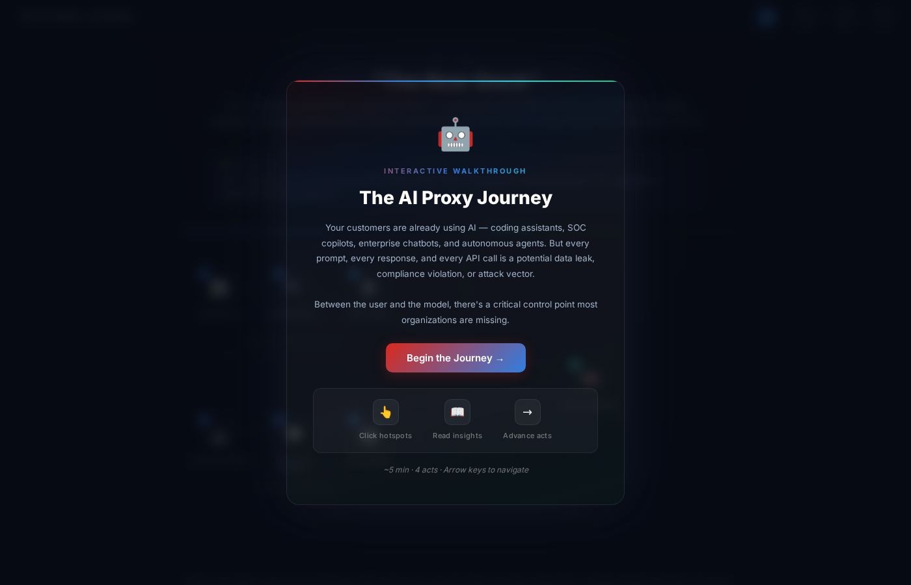

# The AI Proxy Journey — A Seller's Interactive Walkthrough

An interactive, single-file walkthrough that guides sellers through the AI security governance conversation — from shadow AI risks to the AI proxy control point.

## Launch It

**Live version:** [https://40docs.github.io/sales_walkthrough-ai/](https://40docs.github.io/sales_walkthrough-ai/)

Press **F11** (Windows/Linux) or **Ctrl+Cmd+F** (Mac) to go full screen.

## Offline / Download

Click **`ai-proxy-journey.html`** above, then click the **download icon** (down arrow):

Double-click the downloaded file to open it in your browser. No server, no install, no internet required.

## Navigating the Walkthrough

- Click **"Begin the Journey"** to start
- **Click numbered hotspots** on the diagram to open info panels with seller insights
- Use **"Next Act"** to advance through the four acts
- **Arrow keys** (left/right) for quick navigation, **Escape** to close panels
- After Act 4, the **summary card** distills the core message
- From the summary, open **The Armory** — your seller's toolkit with discovery questions, objection responses, and next steps

## The Four Acts

| Act | Title | Theme |
|-----|-------|-------|
| 1 | The New Stack | Your customer is already using AI everywhere |
| 2 | The Blind Spot | Every prompt and response is an unmonitored data flow |
| 3 | The Wake-Up Call | Data exfiltration and automation gone wrong |
| 4 | The Control Point | The AI proxy as the missing governance layer |
